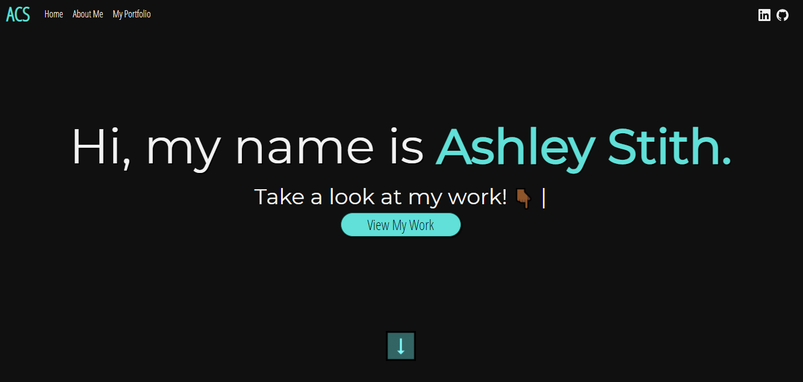
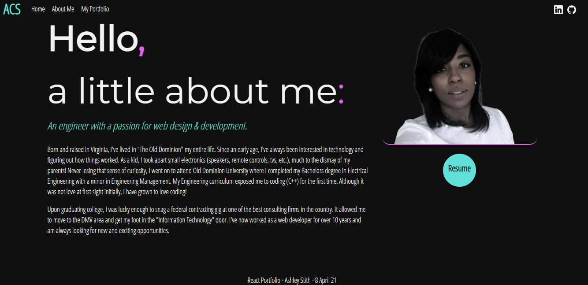
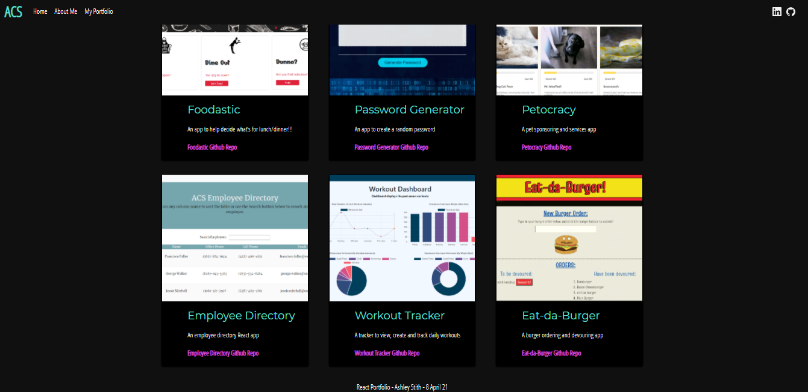

[](https://www.mit.edu/~amini/LICENSE.md)

# React Portfolio, 8 APR 21

#### By Ashley Stith

## Description
This React App is built using the Bootstrap framework to ensure responsiveness on a variety of devices and windows.  It includes one html page, 3 routes, and several components.  One particular component "Project" is rendered to the dom 6 times in the Portfolio component.  A few dependencies are required for the minor animations throughout the application.  The navigation and footer components are included on all "pages"/routes.

## Portfolio Page
Repo has been updated for the Career assignment: React Portfolio.

### Home page:


### About page:


### Portfolio page:
Note: For screenshot, page was scrolled up to see footer



## Installation
* Install node.js to computer, if not already present.

    * Node.js can be installed from [here](https://nodejs.org/en/).

* Copy all the application files locally to one's machine.

* In a terminal window where you copied the files, install all dependencies. These installations are accomplished by performing the following command:

```bash
npm i
```

The application is invoked locally by using the following command:

```bash
npm start
```


## Known Bugs
There are no known bugs.

## Technologies Used
* Reactjs
* Bootstrap


## Contact
Please email [Ashley Stith](mailto:ashleyc.stith@gmail.com) with questions or for additional inforamtion.

## Contribution Guidelines
Direct link to repository: https://github.com/stithac/react-portfolio

## Deployment
The site is deployed to Github pages: https://stithac.github.io/react-portfolio/
